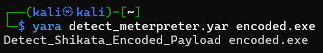

# YARA Detection Rules

Rules ini dibuat berdasarkan analisis statis terhadap payload
yang di-generate menggunakan MSFvenom di lab virtual.

---

## Rules Tersedia
| Rule Name                    | Target                 | Severity |
|------------------------------|------------------------|----------|
| Detect_Meterpreter_Reverse_TCP | MSFvenom Meterpreter  | High     |
| Detect_Shikata_Encoded_Payload | Shikata_ga_nai encoded| High     |

---

## Cara Penggunaan

```bash
# Scan satu file
yara detect_meterpreter.yar target_file.exe

# Scan seluruh direktori
yara -r detect_meterpreter.yar /path/to/folder/
```

---

## Hasil Testing

| File        | Rule Terdeteksi                | Result  |
|-------------|-------------------------------|---------|
| payload.exe | Detect_Meterpreter_Reverse_TCP | ✗ tidak terdeteksi |
| encoded.exe | Detect_Shikata_Encoded_Payload | ✓ terdeteksi       |

`encoded.exe` berhasil dideteksi karena menggunakan encoder
shikata_ga_nai. `payload.exe` tidak terdeteksi karena tidak
di-encode, menunjukkan rule bekerja secara spesifik.

---

## Screenshots


